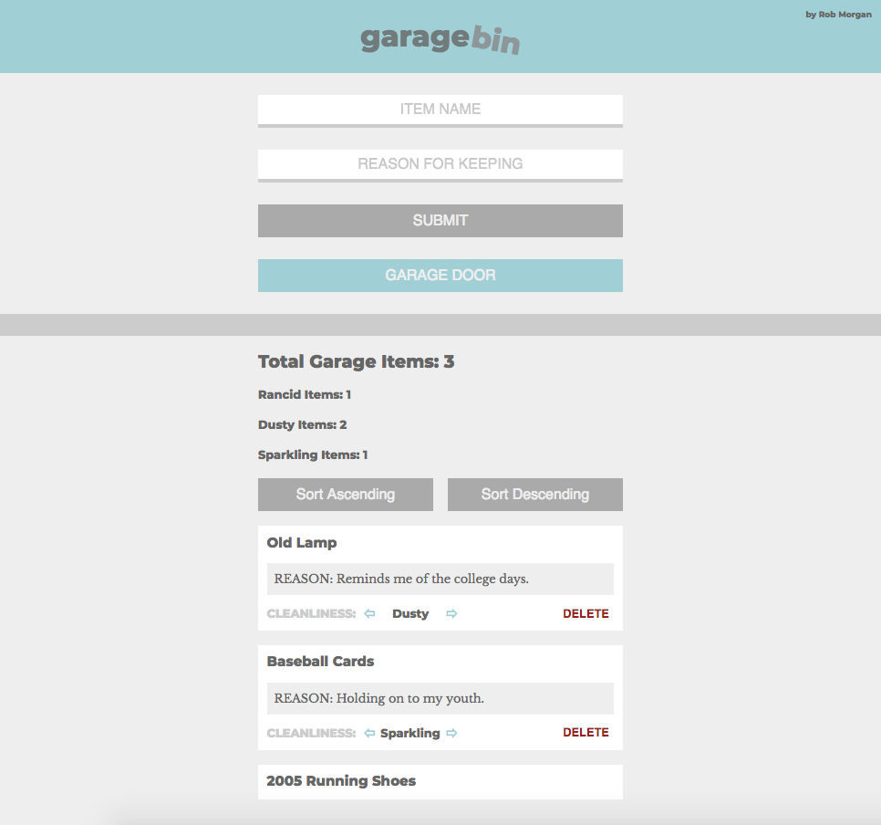

# Garage Bin

**Garage Bin - Turing Mod 4 Final - Live version: https://garage-bin-rmorgan323.herokuapp.com/**

Garage bin is a simple app designed to keep track of junk in the garage.  You can add items with descriptions and a cleanliness rating (which can be edited).  Items can be sorted and deleted.  All items as well as changes are saved to backend created specifically for the project.  It also keeps track of all the items in the garage along with how many are each kind of clean (or not clean).

Backend is build in Node.js/Express/Knex/Postgres.
Frontend is in jQuery.
Testing is done in Mocha/Chai.
Deployed on Heroku.

Entire app, including frontend, backend, testing, and deployment built in 1 day.  

Thanks Turing.

